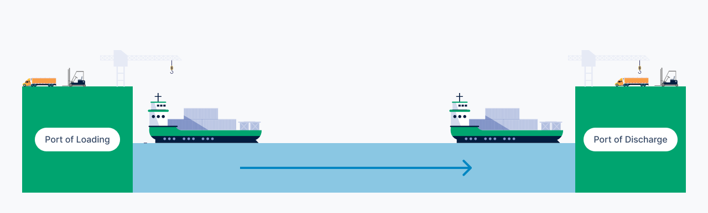
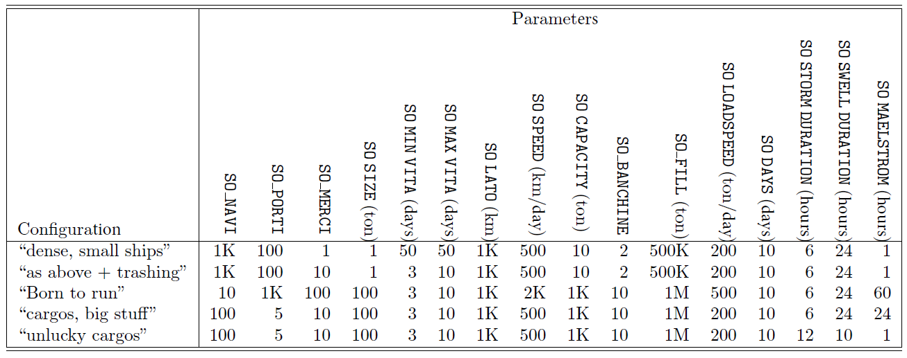

# Maritime transit of goods
This is a Unix project developed during the Operating Systems course attended at the University of Turin.  
The purpose of the project is to simulate the traffic of cargo ships for the transportation of goods between various ports.
 

## Table of Contents
- [Project description](#project-description)
- [Goods](#goods)
- [Map](#map)
- [Ship process](#ship-process)
- [Port process](#port-process)
- [Simulation status dump](#simulation-status-dump)
- [Simulation termination](#simulation-termination)
- [More project details](#more-project-details)
- [Configuration](#configuration)
- [Guidelines](#guidelines)
- [Implementation requirements](#implementation-requirements)

## Project description
The aim is to simulate the traffic of cargo ships for the transportation of various goods through ports. This is achieved through the following processes:
- A **Master** process responsible for creating the other processes and managing the simulation, as necessary
- A number of **Ship** processes (SO_SHIPS) (>= 1)
- A number of **Port** processes (SO_PORTS) (>= 4)

The project description will refer to:
- **Simulated time**, which is the time elapsed in the simulation (e.g., one day to transport a cargo)
- **Real time**, which is the duration of the simulation execution (e.g., after initiation, the simulation ends after 30 seconds, despite simulating a duration of 30 days).

In the simulation, **one day of simulated time equals one second of real time**.

### Goods
In the simulation, there are SO_GOODS different types of goods. If deemed useful, each type of goods can be identified with a name or a numerical identifier. 
Each batch of goods is characterized by:
- a quantity of goods (in tons), randomly generated between 1 and SO_SIZE at the beginning of the simulation; and
- a lifespan (in days), randomly generated between SO_MIN_LIFESPAN and SO_MAX_LIFESPAN, measured in days.

Supply and demand for goods are generated at ports (see description below). 
Every time a certain type of goods is generated at runtime, it will always have the same characteristics as described above.
When the lifespan of a good expires, the good is lost and disappears from wherever it is (ship or port). The lifespan of a good is relative to the moment of its creation at a certain port.
All goods generated during the simulation fall into the following categories:
- Goods present at a port (available for loading)
- Goods present on a ship
- Goods delivered to a requesting port
- Expired goods at a port
- Expired goods on a ship

### Map
The world map is represented by a square of side length SO_SIDE of type (double), measured in kilometers (Flat Earth). A position on the map is represented by a pair of coordinates (as on a Cartesian plane). Both ports and ships have a position on the map. Navigation between two points on the map can always occur in a straight line: there are no large land masses that require circumvention.

### Ship process
Each ship has:
- a speed SO_SPEED measured in kilometers per day (identical for all ships),
- a position, represented by a pair of coordinates of type (double) within the map,
- a capacity SO_CAPACITY (in tons) measuring the total transportable cargo (identical for all ships). A ship cannot carry a quantity of goods that exceeds its capacity.

Ships originate from random positions and without cargo. There is no limit to the number of ships that can occupy a certain position on the map, while the number of ships that can simultaneously perform loading/unloading operations at a port is limited by the number of docks.
The ship's movement from one point to another is achieved through a nanosleep that simulates simulated time: distance between starting and destination positions / sailing speed.
When calculating this time, also consider the fractional part (for example, if you need to sleep for 1.41 seconds, it is not suitable to sleep for 1 or 2 seconds). Ignore any collisions during movement on the map.
Ships can have all information about ports: position, offered/requested goods, etc. 

Each ship, independently:
- moves on the map
- when it is in the position coinciding with the port, it can decide whether to access a dock, and if so, it can decide whether to unload or load the not yet expired goods.

Negotiation between ship and port on the type and quantity of goods to be loaded or unloaded occurs at a discretion of the designer (before departing for the destination, upon arrival at the port, etc.).
Ships cannot communicate with each other, nor know the contents of what is transported by other ships.

### Port process
The port is located at a certain position on the map and manages a random number of docks ranging from 1 to SO_DOCKS. There are always at least four ports (SO_PORTS >= 4), one for each corner of the map.
When port processes are created, demand and supply of goods are randomly generated at each of them. Both the total demand and supply of all goods at all ports are equal to SO_FILL (in tons). 

Both supply and demand for goods are characterized by:
- the type of goods
- the quantity of goods

There cannot be both supply and demand for the same goods at the same port. As soon as the goods are created, they are marked with their expiration date, upon which the goods become unusable and are declared wasted.
The port docks are managed as shared resources protected by semaphores that prevent usage by a number of ships greater than the available docks. When a ship reaches a port (either for loading or unloading), it requests access to a dock. If granted, it occupies the dock (using nanosleep(...)) for a period equal to: quantity of goods exchanged (in tons) / loading/unloading speed (in tons/day)
with "speed" equal to the parameter SO_LOADSPEED, measured in tons/day. The loading and unloading speed is the same.
When goods are unloaded for which there is demand, then that demand is satisfied and accounted for as such.

### Simulation status dump
At the end of each day, a provisional report should be displayed containing:
- Total goods divided by type and status (available, delivered, etc)
- Number of ships:
  - at sea with cargo onboard
  - at sea without cargo
  - in port, engaged in loading/unloading operations

For each port, indicate:
  - the quantity of goods present, shipped, and received
  - the number of docks occupied/total.

### Simulation termination
The simulation terminates under one of the following circumstances:
- After a simulated time of SO_DAYS
- When, for each type of goods:
  - the supply is zero, or
  - the demand is zero.

The final report should indicate:
- Number of ships still at sea with cargo onboard.
- Number of ships still at sea without cargo.
- Number of ships occupying a dock.
- Total goods divided by type and status (available, delivered, etc).
- For each port, indicate the quantity of goods:
  - present, shipped, and received
- For each type of goods, indicate:
  - the total quantity generated since the beginning of the simulation and how much of it:
     - remained idle in port
     - expired at the port
     - expired on ships
     - was delivered by any ship

Indicate the port that:
- offered the highest quantity of the goods
- and the one that requested the highest quantity of goods

### More project details
The generation of goods occurs throughout the entire simulation (not just at the beginning). At the start of each day, a quantity of SO_FILL/SO_DAYS of randomly selected goods is generated at random ports. It should always be remembered that there cannot be both supply and demand for the same goods at the same port.
Furthermore, the simulation aims to simulate some issues that can make navigation, loading, and unloading operations more difficult. 

A new process called weather is responsible for randomly generating a series of inconveniences:
- Storm: randomly hits a moving ship each day, stopping it in place for SO_STORM_DURATION hours.
- Swell: randomly hits a port each day, halting all operations for SO_SWELL_DURATION hours.
- Maelstrom: every SO_MAELSTROM hours, a ship is sunk, and its cargo, if any, is dispersed.

The simulation status dumps and the final report will account for the weather effects on maritime traffic, specifying (in addition):
- How many ships were slowed down by the storm.
- Which ports were affected by the swell.
- How many ships were sunk due to the maelstrom.
In addition, the simulation also ends when all ships are sunk due to the maelstrom.

## Configuration
All configuration parameters are read at runtime, from files, environment variables, or stdin (at the discretion of the designer). Therefore, a change in parameters should not necessitate a recompilation of the sources.
The following table lists values for some example configurations to be tested. Note that the project should also be able to function with other feasible parameters.
There may be configuration parameter values that result in bizarre behaviors. In such cases, it is sufficient to be able to identify these behaviors and suggest parameter configurations that can make the behavior more natural.

## Guidelines
- Minimization of wasted goods quantity 
- CPU time utilization (avoiding busy waiting)

## Implementation requirements
The project must:
- Utilize shared memory, semaphores, and a inter-process communication mechanism chosen between message queues or pipes
- Be implemented utilizing code modularization techniques (for example, various processes must be launched from different executables using execve(...))
- Be compiled using the make utility
- Maximize the degree of concurrency among processes
- Deallocate IPC resources that have been allocated by processes at the end of the game
- Be compiled with at least the following compilation options:
  - gcc -std=c89 -Wpedantic
- Be able to run correctly on a machine (virtual or physical) that has parallelism (two or more processors).

